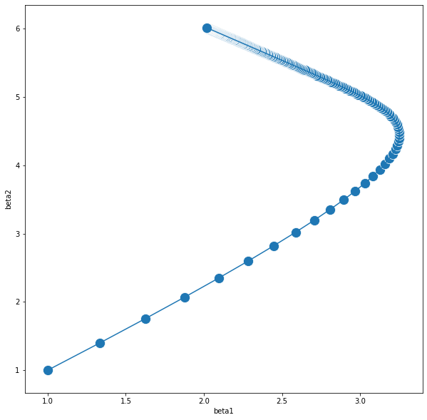
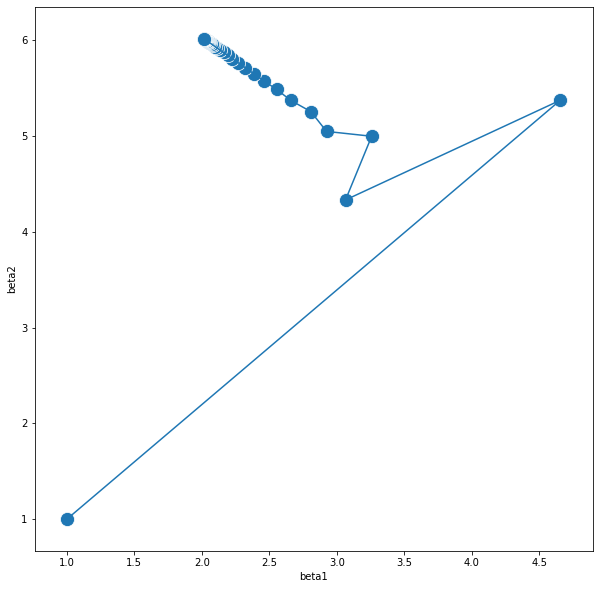
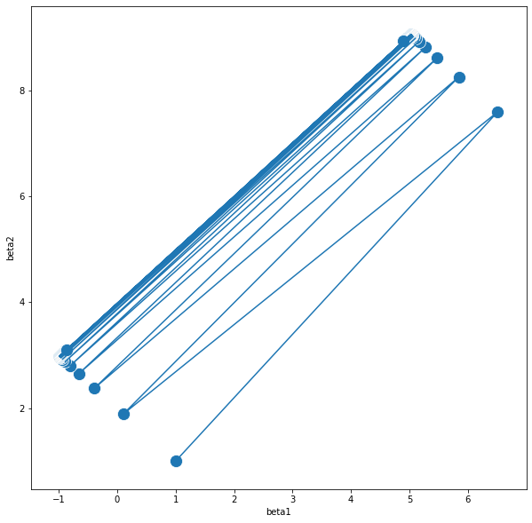
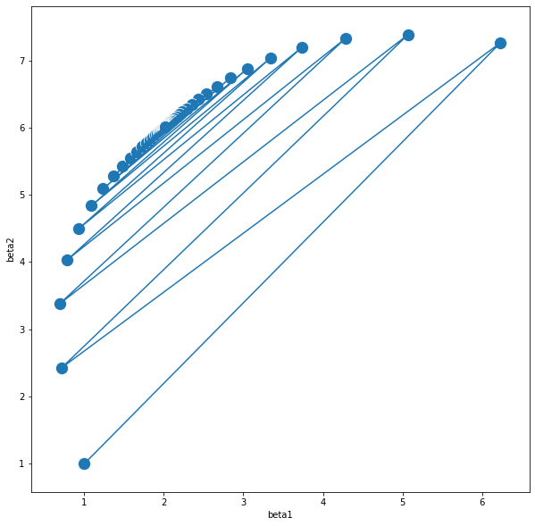
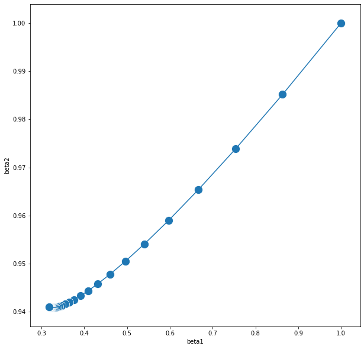
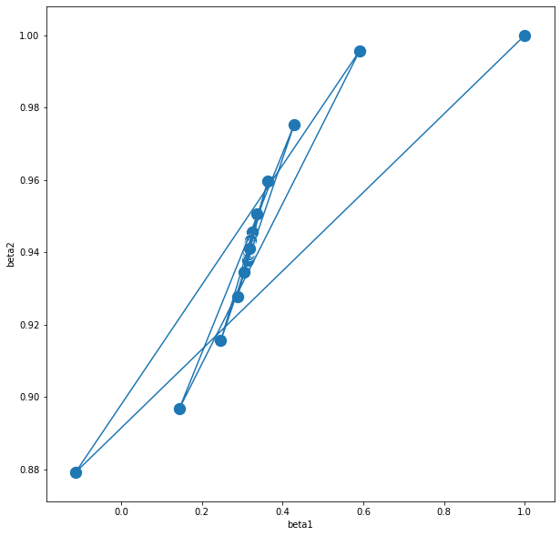
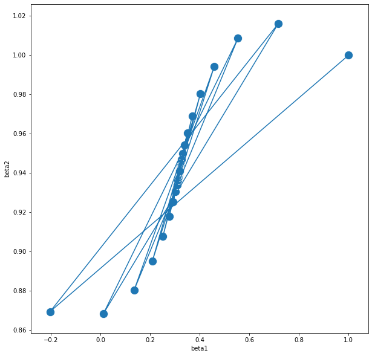
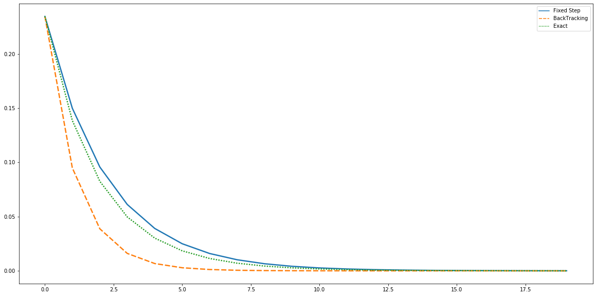

```python
from IPython.core.display import display,HTML
display(HTML('<style>.prompt{width: 0px; min-width: 0px; visibility: collapse}</style>'))

import numpy as np
import pandas as pd
import matplotlib.pyplot as plt
import seaborn as sns
```


<style>.prompt{width: 0px; min-width: 0px; visibility: collapse}</style>


## 실습1. Basic Gradient Descent 

아래의 문제들을 Gradient Descent 방식으로 풀어보자

**문제 0. 𝑓(𝑥)=𝑥2−2𝑥+1 의 최솟값을 구해보자.**

선형회귀모델 $y= \beta_0 + \beta_1 x_1 + \beta_2 x_2 + \epsilon$을 가정하여 데이터 "practice_1.csv"에 대해 회귀분석을 시행하라 

**문제 1. 제약이 없는 LSE를 Gradient Descent 방법으로 풀어보자.**  
**문제 2. 문제 1의 Step Size를 Backtracking Line Search를 통해서 풀어보자.**  
**문제 3. 문제 1의 Step Size를 Exact Line Search를 통해서 풀어보자.**  
**문제 4. 주어진 데이터의 절편은 3일때 최적값이다. 문제 1,2,3이 절편을 잘 추정했는지 확인하고 오류가 났다면 어째서 인지, 어떻게 해결할 수 있을지에 대해서 생각해보자.**  
**문제 5. 위의 각 결과물의 이터레이션에 따른 오차를 비교해주는 그림을 그려보자.**  

Gradient Descent Method는 다음과 같다.  

> #### Gradient Descent
For unconstrained optimization problem whose objective function $f(x)$ is smooth convex function, sequence $\{x_{k}\}$ that has folloing iteration form converges to problem's solution $x^*$ such that $x^* = \underset{x}{argmin} f(x)$ under appropriate step size $t_k$
$$  x^{(k+1)} = x^{(k)} - t_k \nabla f(x^{(k)})$$

***

## 문제 0. 몸풀기 $f(x) = x^2-2x+1$의 최솟값을 구해보자.

 주어진 문제는 다음과 같은 mathematical optimization 문제라고 볼 수 있다.  
$$ \underset{x}{min} \ x^2 -2x +1 $$  
이는 unconstrained convex optimization 문제이므로 기본적인 Gradient Descent를 이용해서 풀 수 있다.  

Iteration Form을 유도해내면 다음과 같다.  
$x^{(k+1)} = x^{(k)} - t_k \nabla f(x^{(k)}) \\ \quad =x^{(k)}- t_k (2x^{(k)}-2)$

이 식을 이용해서 Gradient Descent를 설계해보자.  

**우선 초기값 $x_0$ 및 현재값 $x_k$ 가 들어갈 인스턴스와 결과물을 저장해줄 공간을 정의해주자.**


```python
## 초기값 설정 (x-initial value)
x_init = np.array([100])
## 현재값 설정 (x-temporary value)
x_temp = x_init
## 결과물 공간 (x-result)
x_result = pd.DataFrame(x_init,columns=["x"])
```

**다음으로 스텝사이즈(learning-rate)와 이터레이션 횟수를 지정해주자. 스텝사이즈를 지정해주는 것은 또다른 추론들이 필요하지만 간단하게 고정된 스텝사이즈를 사용하자. 이터레이션 횟수 또한 100으로 적게 정해주자.**


```python
## 스텝사이즈 t 설정
t=0.1
## 이터레이션 횟수 설정
iter = 100
```

**마지막으로 이터레이션 폼을 구현하자.**


```python
for i in range(iter):
    # 이터레이션 공식
    x_temp = x_temp - 2*t*(2*x_temp-2)
    # 결과물 저장
    x_result = x_result.append(pd.DataFrame(np.array([x_temp]),columns=["x"]),ignore_index=True)
```


```python
x_result
```


<div>
<style scoped>
    .dataframe tbody tr th:only-of-type {
        vertical-align: middle;
    }

    .dataframe tbody tr th {
        vertical-align: top;
    }
    
    .dataframe thead th {
        text-align: right;
    }
</style>
<table border="1" class="dataframe">
  <thead>
    <tr style="text-align: right;">
      <th></th>
      <th>x</th>
    </tr>
  </thead>
  <tbody>
    <tr>
      <td>0</td>
      <td>100.0000</td>
    </tr>
    <tr>
      <td>1</td>
      <td>60.4000</td>
    </tr>
    <tr>
      <td>2</td>
      <td>36.6400</td>
    </tr>
    <tr>
      <td>3</td>
      <td>22.3840</td>
    </tr>
    <tr>
      <td>4</td>
      <td>13.8304</td>
    </tr>
    <tr>
      <td>...</td>
      <td>...</td>
    </tr>
    <tr>
      <td>96</td>
      <td>1.0000</td>
    </tr>
    <tr>
      <td>97</td>
      <td>1.0000</td>
    </tr>
    <tr>
      <td>98</td>
      <td>1.0000</td>
    </tr>
    <tr>
      <td>99</td>
      <td>1.0000</td>
    </tr>
    <tr>
      <td>100</td>
      <td>1.0000</td>
    </tr>
  </tbody>
</table>
<p>101 rows × 1 columns</p>
</div>


주어진 문제를 최소화 시키는 closed form solution은 1이므로 이터레이션 폼이 정답을 잘 찾아냈다고 말 할 수 있다. 

***

## 문제 1. 제약이 없는 LSE를 Gradient Descent 방법으로 풀어보자. 

 LSE는 오차의 제곱합(SSE;Sum of Squared Error)를 최소화 시켜주는 추정량을 찾음으로써 모수를 추정하는 방법이다.  

선형 회귀모델 $y_i = \beta_0 + \beta_1 x_{i1} + \beta_2 x_{i2} + \epsilon_i$ or $y= X\beta+\epsilon$의 SSE는 다음과 같다.  
$f(\beta) = \sum_i^n \epsilon_i^2 = \epsilon^t\epsilon \\ \quad= (y-X\beta)^t(y-X\beta) \\ \quad = y^ty-2\beta^tX^ty + \beta^tX^tX\beta$

 이때 목적함수 $f(\beta)$는 L2-Norm의 Affine Transformation 꼴이므로 Convex Function이다.  
 따라서 이에 대한 Convex Optimization Problem을 다음과 같이 설계 할 수 있다.  
$$\underset{\beta}{min} \{y^ty-2\beta^tX^ty+\beta^tX^tX\beta\}$$


이에 대한 Gradient를 구하면 다음과 같다.  
$\frac{\delta}{\delta \beta}\{y^ty-2\beta^tX^ty+\beta^tX^tX\beta\} \\ \quad = \{-2y^tX+2X^tX\beta\}$  

따라서 이터레이션 폼은 다음과 같은 형태를 띈다.  
$x^+ = x - t \nabla f(x) \\ \quad = x - 2t(X^tX\beta-y^tX)$

**우선 위에서 구한 공식을 이용해 현재의 $\beta$값을 넣으면 현재의 Gradient를 계산해주는 함수를 짜자.**


```python
def gradient(beta) : 
    return((x_mat.transpose()@x_mat@beta-x_mat.transpose()@y_mat))
```

**데이터를 불러온 다음 X와 Y를 나눠서 행렬에 저장해주자**


```python
df = pd.read_csv("practice.csv")
```


```python
df.head()
```


<div>
<style scoped>
    .dataframe tbody tr th:only-of-type {
        vertical-align: middle;
    }

    .dataframe tbody tr th {
        vertical-align: top;
    }
    
    .dataframe thead th {
        text-align: right;
    }
</style>
<table border="1" class="dataframe">
  <thead>
    <tr style="text-align: right;">
      <th></th>
      <th>y</th>
      <th>x0</th>
      <th>x1</th>
      <th>x2</th>
    </tr>
  </thead>
  <tbody>
    <tr>
      <td>0</td>
      <td>463.029335</td>
      <td>1.0</td>
      <td>93.125595</td>
      <td>45.841138</td>
    </tr>
    <tr>
      <td>1</td>
      <td>171.681165</td>
      <td>1.0</td>
      <td>71.924815</td>
      <td>4.365620</td>
    </tr>
    <tr>
      <td>2</td>
      <td>402.521038</td>
      <td>1.0</td>
      <td>60.908435</td>
      <td>46.282571</td>
    </tr>
    <tr>
      <td>3</td>
      <td>293.383192</td>
      <td>1.0</td>
      <td>60.735983</td>
      <td>28.166286</td>
    </tr>
    <tr>
      <td>4</td>
      <td>554.876057</td>
      <td>1.0</td>
      <td>26.853625</td>
      <td>82.930904</td>
    </tr>
  </tbody>
</table>
</div>


```python
x_mat = df.iloc[:,1:4]
y_mat = df.iloc[:,0]
```

**Gradient Descent의 경우 $ \parallel \nabla f(x) \parallel_2$가 충분히 작아질 때, Ealry Stopping을 해준다. 이를 구현해주는 코드도 짜보자.**

**나머지는 0번 문제에서 했던 것과 똑같은 절차를 취해주면 된다.  
우선 Initial Point 및 Place Holder 만들어주자**


```python
## 기본값 설정 (beta-temporary value)
beta_init = [1,1,1]

## 현재값 설정 (beta-temporary value)
beta_temp = beta_init

## 결과물 공간 (Gradient Descent Result A)
GD_result_A = pd.DataFrame([beta_init],columns=["beta0","beta1","beta2"])
```

**다음으로 Step Size를 지정해주자. 0.01 정도면 충분히 낮은 수치라고 말할 수 있다.**


```python
t_fixed= 0.01
```

**위에서 정의해준 Gradient를 이용해서 이터레이션 폼을 짜주자.**


```python
for i in range(1000) : 
    beta_temp = beta_temp - 2*t_fixed*(gradient(beta_temp))
    GD_result_A = GD_result_A.append(pd.DataFrame(np.array([beta_temp]),columns=["beta0","beta1","beta2"]),ignore_index=True)
    if sum(gradient(beta_temp)**2)**(1/2) < 0.0001 : break
```


```python
GD_result_A
```


<div>
<style scoped>
    .dataframe tbody tr th:only-of-type {
        vertical-align: middle;
    }

    .dataframe tbody tr th {
        vertical-align: top;
    }
    
    .dataframe thead th {
        text-align: right;
    }
</style>
<table border="1" class="dataframe">
  <thead>
    <tr style="text-align: right;">
      <th></th>
      <th>beta0</th>
      <th>beta1</th>
      <th>beta2</th>
    </tr>
  </thead>
  <tbody>
    <tr>
      <td>0</td>
      <td>1.000000e+00</td>
      <td>1.000000e+00</td>
      <td>1.000000e+00</td>
    </tr>
    <tr>
      <td>1</td>
      <td>6.222271e+03</td>
      <td>3.348455e+05</td>
      <td>4.006690e+05</td>
    </tr>
    <tr>
      <td>2</td>
      <td>-7.547918e+08</td>
      <td>-4.401388e+10</td>
      <td>-4.542721e+10</td>
    </tr>
    <tr>
      <td>3</td>
      <td>9.174036e+13</td>
      <td>5.402243e+15</td>
      <td>5.470796e+15</td>
    </tr>
    <tr>
      <td>4</td>
      <td>-1.115184e+19</td>
      <td>-6.575143e+20</td>
      <td>-6.642294e+20</td>
    </tr>
    <tr>
      <td>...</td>
      <td>...</td>
      <td>...</td>
      <td>...</td>
    </tr>
    <tr>
      <td>996</td>
      <td>NaN</td>
      <td>NaN</td>
      <td>NaN</td>
    </tr>
    <tr>
      <td>997</td>
      <td>NaN</td>
      <td>NaN</td>
      <td>NaN</td>
    </tr>
    <tr>
      <td>998</td>
      <td>NaN</td>
      <td>NaN</td>
      <td>NaN</td>
    </tr>
    <tr>
      <td>999</td>
      <td>NaN</td>
      <td>NaN</td>
      <td>NaN</td>
    </tr>
    <tr>
      <td>1000</td>
      <td>NaN</td>
      <td>NaN</td>
      <td>NaN</td>
    </tr>
  </tbody>
</table>
<p>1001 rows × 3 columns</p>
</div>


**Step Size 설정이 잘 되지 못해서 값이 발산해버렸다. 0.01이면 충분히 낮은 수치라고 볼 수 있지만 SSE 함수에 포함된 데이터들이 필요로 하는 스텝사이즈는 그보다 훨신 낮은 수치이기 때문이다. 따라서 Step Size를 극단적으로 낮춰준 후 다시 돌려주자.**


```python
t_fixed = 0.00000001
```


```python
## 초기값
beta_init = [1,1,1]

## 현재값
beta_temp = beta_init

## 전체 결과물 저장소
GD_result_A = pd.DataFrame([beta_init],columns=["beta0","beta1","beta2"])
```


```python
for i in range(1000) : 
    beta_temp = beta_temp - 2*t_fixed*(gradient(beta_temp))
    GD_result_A = GD_result_A.append(pd.DataFrame(np.array([beta_temp]),columns=["beta0","beta1","beta2"]),ignore_index=True)
    if sum(gradient(beta_temp)**2)**(1/2) < 0.01 : break
```


```python
GD_result_A
```


<div>
<style scoped>
    .dataframe tbody tr th:only-of-type {
        vertical-align: middle;
    }

    .dataframe tbody tr th {
        vertical-align: top;
    }
    
    .dataframe thead th {
        text-align: right;
    }
</style>
<table border="1" class="dataframe">
  <thead>
    <tr style="text-align: right;">
      <th></th>
      <th>beta0</th>
      <th>beta1</th>
      <th>beta2</th>
    </tr>
  </thead>
  <tbody>
    <tr>
      <td>0</td>
      <td>1.000000</td>
      <td>1.000000</td>
      <td>1.000000</td>
    </tr>
    <tr>
      <td>1</td>
      <td>1.006221</td>
      <td>1.334844</td>
      <td>1.400668</td>
    </tr>
    <tr>
      <td>2</td>
      <td>1.011688</td>
      <td>1.625674</td>
      <td>1.755908</td>
    </tr>
    <tr>
      <td>3</td>
      <td>1.016491</td>
      <td>1.877892</td>
      <td>2.071191</td>
    </tr>
    <tr>
      <td>4</td>
      <td>1.020712</td>
      <td>2.096243</td>
      <td>2.351323</td>
    </tr>
    <tr>
      <td>...</td>
      <td>...</td>
      <td>...</td>
      <td>...</td>
    </tr>
    <tr>
      <td>996</td>
      <td>1.056884</td>
      <td>2.017191</td>
      <td>6.016294</td>
    </tr>
    <tr>
      <td>997</td>
      <td>1.056889</td>
      <td>2.017191</td>
      <td>6.016294</td>
    </tr>
    <tr>
      <td>998</td>
      <td>1.056895</td>
      <td>2.017191</td>
      <td>6.016294</td>
    </tr>
    <tr>
      <td>999</td>
      <td>1.056900</td>
      <td>2.017191</td>
      <td>6.016294</td>
    </tr>
    <tr>
      <td>1000</td>
      <td>1.056905</td>
      <td>2.017191</td>
      <td>6.016294</td>
    </tr>
  </tbody>
</table>
<p>1001 rows × 3 columns</p>
</div>


```python
plt.figure(figsize=(10,10))
sns.lineplot(x="beta1", y="beta2",
                  sort=False, data=GD_result_A)
sns.scatterplot(x="beta1", y="beta2",data=GD_result_A,s=200,marker="o")
plt.show()
```





**이렇게 나온 결과물을 보면 계수들은 그럭저럭 잘 추정을 해냈지만 절편값은 추정을 잘 해주지 못했다. 정확하게는 계수는 빠르게 수렴한 반면 절편은 수렴이 비교적 매우 늦기 때문에 일어난 상황이다. 이는 Gradient Descent의 근본적인 단점이라고 볼 수 있는 데 이에 대해서는 다른 문제들을 본 후 다시 살펴보자.**

## 문제 2. 문제 1의 Step Size를 Backtracking Line Search를 통해서 풀어보자.

문제 1번에서는 두 가지 문제가 발생했다고 볼 수 있다. 하나는 스텝 사이즈를 자의적으로 정해주는 것이 어렵다는 점이고, 또 하나는 절편을 잘 추정해주지 못했다는 점이다. 우선 전자의 문제를 해결해주기 위해 Backtracking Line Search를 사용해주자. 

Backtracking Line Search는 다음과 같은 알고리즘이다. 
1. 우선 initial step size $t_0$를 임의로 정해준다. 
2. 알고리즘의 하이퍼 파라미터인 $\alpha \in (0,0.5] , \beta \in (0,1)$를 임의로 정해주자. 
3. 다음의 조건을 체크하고 조건이 성립하지 않을 때 까지 $t = \beta t$를 넣어주며 t를 축소해주자.  
$$ f(x^+) > f(x) - \alpha t \parallel \nabla f(x) \parallel_2^2$$  
4. 조건이 성립하지 않는다면 구해진 t값을 이용해서 Gradient Descent Step을 1회 진행하자.

따라서 이 조건을 구현해 주기 위해서 현재의 t값을 넣었을 때 조건문을 체크해주는 함수를 짜보자.


```python
def backtracking(alpha,t) : 
    beta_plus = beta_temp - 2*t_temp*(x_mat.transpose()@x_mat@beta_temp-x_mat.transpose()@y_mat)
    res_plus = sum((y_mat-x_mat@beta_plus)**2)
    res = x_mat.transpose()@x_mat@beta_temp-x_mat.transpose()@y_mat
    res_temp = sum((y_mat-x_mat@beta_temp)**2)-alpha*t_temp*sum(res**2)
    return(res_plus>res_temp)
```

**나머지는 마찬가지로 초기값 및 하이퍼파라미터를 설정해주자**


```python
## 모수 초기값
beta_init = np.array([1,1,1])

## 모수 현재값
beta_temp = beta_init

## 스텝 초기값
t_init = np.array([0.5])

## 스텝 현재값
t_temp = t_init

## 전체 결과물 저장소
GD_result_B = pd.DataFrame([[*t_init,*beta_init]],columns=["Step","beta0","beta1","beta2"])

## 하이퍼 파라미터
alpha = 0.5
beta = 0.7
```

**backtracking line search는 while 문을 이용하여 구현을 해주면 된다.**


```python
for i in range(1000) : 
    while (backtracking(alpha,t_temp)):
        t_temp = t_temp * beta
    beta_temp = beta_temp - 2*t_temp*gradient(beta_temp)
    GD_result_B = GD_result_B.append(pd.DataFrame([[*t_temp,*beta_temp]],columns=["Step","beta0","beta1","beta2"]),ignore_index=True)
    if sum(gradient(beta_temp)**2)**(1/2) < 0.01 : break
```


```python
GD_result_B
```


<div>
<style scoped>
    .dataframe tbody tr th:only-of-type {
        vertical-align: middle;
    }

    .dataframe tbody tr th {
        vertical-align: top;
    }
    
    .dataframe thead th {
        text-align: right;
    }
</style>
<table border="1" class="dataframe">
  <thead>
    <tr style="text-align: right;">
      <th></th>
      <th>Step</th>
      <th>beta0</th>
      <th>beta1</th>
      <th>beta2</th>
    </tr>
  </thead>
  <tbody>
    <tr>
      <td>0</td>
      <td>5.000000e-01</td>
      <td>1.000000</td>
      <td>1.000000</td>
      <td>1.000000</td>
    </tr>
    <tr>
      <td>1</td>
      <td>1.091907e-07</td>
      <td>1.067931</td>
      <td>4.656191</td>
      <td>5.374923</td>
    </tr>
    <tr>
      <td>2</td>
      <td>1.091907e-07</td>
      <td>1.045869</td>
      <td>3.064698</td>
      <td>4.333640</td>
    </tr>
    <tr>
      <td>3</td>
      <td>1.091907e-07</td>
      <td>1.053248</td>
      <td>3.258541</td>
      <td>4.998424</td>
    </tr>
    <tr>
      <td>4</td>
      <td>1.091907e-07</td>
      <td>1.050977</td>
      <td>2.923954</td>
      <td>5.049299</td>
    </tr>
    <tr>
      <td>...</td>
      <td>...</td>
      <td>...</td>
      <td>...</td>
      <td>...</td>
    </tr>
    <tr>
      <td>996</td>
      <td>1.091907e-07</td>
      <td>1.108915</td>
      <td>2.016760</td>
      <td>6.015847</td>
    </tr>
    <tr>
      <td>997</td>
      <td>1.091907e-07</td>
      <td>1.108972</td>
      <td>2.016760</td>
      <td>6.015846</td>
    </tr>
    <tr>
      <td>998</td>
      <td>1.091907e-07</td>
      <td>1.109028</td>
      <td>2.016759</td>
      <td>6.015846</td>
    </tr>
    <tr>
      <td>999</td>
      <td>1.091907e-07</td>
      <td>1.109085</td>
      <td>2.016759</td>
      <td>6.015845</td>
    </tr>
    <tr>
      <td>1000</td>
      <td>1.091907e-07</td>
      <td>1.109142</td>
      <td>2.016758</td>
      <td>6.015845</td>
    </tr>
  </tbody>
</table>
<p>1001 rows × 4 columns</p>
</div>


```python
plt.figure(figsize=(10,10))
sns.lineplot(x="beta1", y="beta2",
                  sort=False, data=GD_result_B)
sns.scatterplot(x="beta1", y="beta2",data=GD_result_B,s=200,marker="o")
plt.show()
```





결과물은 마찬가지로 계수는 잘 찾아줬고 절편은 잘 찾아주지 못했다. 

## 문제 C. A의 Step Size를 Exact Line Search를 통해서 풀어보자.

 Gradient Descent에서 Convergence Analysis를 해보면 Strong Convexity Constant $\mu$와 Lipschitz Constant L을 찾아서 평균의 역수를 사용함으로써 최적의 Exact Step Size를 찾을 수 있다. 많은 방식이 있지만 이 문제에 대해서는 아래를 만족하는 Constant를 찾아서 구해줄 수 있다.  
$$ LI \prec \nabla^2 f(x) \prec mI$$


$\nabla^2 f(x) = \nabla \{ \nabla f(x)\} \\ \qquad \quad = \nabla \{-2y^tX+2X^tX\beta \} \\ \qquad \quad = 2X^tX$  


Quadratic Form Theorem을 쓰면 아래와 같은 관계식을 얻을 수 있다.  
$$\lambda_p \leq \frac{x^t A x}{x^t x} \leq \lambda_1$$
$$\lambda_p x^t x \leq x^t A x \leq \lambda_1 x^t x$$ 
$$ \lambda_p I \leq A \leq \lambda_1 I$$
따라서 Hessian Matrix의 아이젠 밸류의 최대값과 최소값이 Lipschit Constant L과 Strong Convexity Constant $\mu$가 된다.  
따라서 아래와 같이 분해를 해준 뒤 이론상의 정확한 step size를 찾아주자


```python
eigen = np.linalg.svd(2*x_mat.transpose()@x_mat)[1]
t_fixed = 2/(np.min(eigen)+np.max(eigen))
t_fixed
```


    1.6452166570173455e-07


**이제 앞에서 진행한 것과 똑같이 코딩을 해주자**


```python
## 초기값
beta_init = [1,1,1]

## 현재값
beta_temp = beta_init

## 전체 결과물 저장소
GD_result_C = pd.DataFrame([beta_init],columns=["beta0","beta1","beta2"])
```


```python
for i in range(1000) : 
    beta_temp = beta_temp - 2*t_fixed*((x_mat.transpose()@x_mat@beta_temp-x_mat.transpose()@y_mat))
    GD_result_C = GD_result_C.append(pd.DataFrame(np.array([beta_temp]),columns=["beta0","beta1","beta2"]),ignore_index=True)
    if sum(gradient(beta_temp)**2)**(1/2) < 0.01 : break
```


```python
GD_result_C
```


<div>
<style scoped>
    .dataframe tbody tr th:only-of-type {
        vertical-align: middle;
    }

    .dataframe tbody tr th {
        vertical-align: top;
    }
    
    .dataframe thead th {
        text-align: right;
    }
</style>
<table border="1" class="dataframe">
  <thead>
    <tr style="text-align: right;">
      <th></th>
      <th>beta0</th>
      <th>beta1</th>
      <th>beta2</th>
    </tr>
  </thead>
  <tbody>
    <tr>
      <td>0</td>
      <td>1.000000</td>
      <td>1.000000</td>
      <td>1.000000</td>
    </tr>
    <tr>
      <td>1</td>
      <td>1.102353</td>
      <td>6.508917</td>
      <td>7.591857</td>
    </tr>
    <tr>
      <td>2</td>
      <td>1.000401</td>
      <td>0.104250</td>
      <td>1.887543</td>
    </tr>
    <tr>
      <td>3</td>
      <td>1.102689</td>
      <td>5.843695</td>
      <td>8.250053</td>
    </tr>
    <tr>
      <td>4</td>
      <td>1.000703</td>
      <td>-0.388961</td>
      <td>2.376475</td>
    </tr>
    <tr>
      <td>...</td>
      <td>...</td>
      <td>...</td>
      <td>...</td>
    </tr>
    <tr>
      <td>996</td>
      <td>1.088479</td>
      <td>-0.865018</td>
      <td>3.105686</td>
    </tr>
    <tr>
      <td>997</td>
      <td>1.186289</td>
      <td>4.897940</td>
      <td>8.925389</td>
    </tr>
    <tr>
      <td>998</td>
      <td>1.088652</td>
      <td>-0.864764</td>
      <td>3.105942</td>
    </tr>
    <tr>
      <td>999</td>
      <td>1.186453</td>
      <td>4.897683</td>
      <td>8.925130</td>
    </tr>
    <tr>
      <td>1000</td>
      <td>1.088825</td>
      <td>-0.864509</td>
      <td>3.106199</td>
    </tr>
  </tbody>
</table>
<p>1001 rows × 3 columns</p>
</div>


```python
plt.figure(figsize=(10,10))
sns.lineplot(x="beta1", y="beta2",
                  sort=False, data=GD_result_C)
sns.scatterplot(x="beta1", y="beta2",data=GD_result_C,s=200,marker="o")
plt.show()
```





이론 상의 정확한 stepsize를 구해줬음에도 수렴을 제대로 해주지 못했다. 스텝을 약간만 줄인 뒤 다시 한번 더 확인해보자. 


```python
## 초기값
beta_init = [1,1,1]

## 현재값
beta_temp = beta_init

## 전체 결과물 저장소
GD_result_C = pd.DataFrame([beta_init],columns=["beta0","beta1","beta2"])
```


```python
eigen = 2*np.linalg.svd(x_mat.transpose()@x_mat)[1]
t_fixed = 1.9/(np.min(eigen)+np.max(eigen))
```


```python
for i in range(1000) : 
    beta_temp = beta_temp - 2*t_fixed*((x_mat.transpose()@x_mat@beta_temp-x_mat.transpose()@y_mat))
    GD_result_C = GD_result_C.append(pd.DataFrame(np.array([beta_temp]),columns=["beta0","beta1","beta2"]),ignore_index=True)
    if sum(gradient(beta_temp)**2)**(1/2) < 0.01 : break
```


```python
GD_result_C
```


<div>
<style scoped>
    .dataframe tbody tr th:only-of-type {
        vertical-align: middle;
    }

    .dataframe tbody tr th {
        vertical-align: top;
    }
    
    .dataframe thead th {
        text-align: right;
    }
</style>
<table border="1" class="dataframe">
  <thead>
    <tr style="text-align: right;">
      <th></th>
      <th>beta0</th>
      <th>beta1</th>
      <th>beta2</th>
    </tr>
  </thead>
  <tbody>
    <tr>
      <td>0</td>
      <td>1.000000</td>
      <td>1.000000</td>
      <td>1.000000</td>
    </tr>
    <tr>
      <td>1</td>
      <td>1.097236</td>
      <td>6.233471</td>
      <td>7.262264</td>
    </tr>
    <tr>
      <td>2</td>
      <td>1.010086</td>
      <td>0.714933</td>
      <td>2.427234</td>
    </tr>
    <tr>
      <td>3</td>
      <td>1.088826</td>
      <td>5.070852</td>
      <td>7.383132</td>
    </tr>
    <tr>
      <td>4</td>
      <td>1.018235</td>
      <td>0.689745</td>
      <td>3.379496</td>
    </tr>
    <tr>
      <td>...</td>
      <td>...</td>
      <td>...</td>
      <td>...</td>
    </tr>
    <tr>
      <td>996</td>
      <td>1.133143</td>
      <td>2.016560</td>
      <td>6.015638</td>
    </tr>
    <tr>
      <td>997</td>
      <td>1.133223</td>
      <td>2.016559</td>
      <td>6.015638</td>
    </tr>
    <tr>
      <td>998</td>
      <td>1.133304</td>
      <td>2.016559</td>
      <td>6.015637</td>
    </tr>
    <tr>
      <td>999</td>
      <td>1.133384</td>
      <td>2.016558</td>
      <td>6.015636</td>
    </tr>
    <tr>
      <td>1000</td>
      <td>1.133464</td>
      <td>2.016557</td>
      <td>6.015636</td>
    </tr>
  </tbody>
</table>
<p>1001 rows × 3 columns</p>
</div>


```python
plt.figure(figsize=(10,10))
sns.lineplot(x="beta1", y="beta2",
                  sort=False, data=GD_result_C)
sns.scatterplot(x="beta1", y="beta2",data=GD_result_C,s=200,marker="o")
plt.show()
```





이제는 제대로 수렴이 되었다. 따라서 알 수 있는 점은 이론상의 스텝사이즈가 수렴의 분기점이 될수 있다는 점이다. 

이제 두번째 문제점이었던 절편의 수렴 문제에 대해서 해결해보자.  
이론상의 exact한 t step은 선형모델에서는 Design Matrix의 내적 형태의 아이젠 밸류에 의존한다.  

이 아이젠 밸류는 Design Matrix의 공분산과 연결되어 있다. 그렇다면 생각해 볼 수 있는 것은 선형모델의 LSE에서의 Gradient Descent는 데이터의 분산에 크게 영향을 받는다 라고 말 할 수 있다. 디자인 매트릭스에서 서로 꼬이기 마련이지만, 절편에 해당하는 데이터는 모두 1로, 분산이 0 인 반면 나머지 데이터들의 분산은 800가량을 차지한다. 이 불균형이 계수와 절편의 수렴 불균형에 영향을 미치는 것으로 보인다. 따라서 스케일링을 통해서 수정을 해줄 수 있겠다. 


```python
np.cov(x_mat.T)
```


    array([[  0.        ,   0.        ,   0.        ],
           [  0.        , 812.12127197,  17.96454473],
           [  0.        ,  17.96454473, 792.58225054]])


### 스케일링 후  A,B,C를 다시 풀어보자.

**스케일링 기법은 편의상 사이킷런의 StandardScaler를 사용해 주었다.**


```python
from sklearn import preprocessing
x_scaled = preprocessing.scale(x_mat)
y_scaled = preprocessing.scale(y_mat)
```

**스케일링 이후의 Gradient를 구해주는 함수도 짜주자.**


```python
def gradient_scaled(beta) : 
    return((x_scaled.transpose()@x_scaled@beta-x_scaled.transpose()@y_scaled))
```

#### 스케일링 후 Fixed Step GD


```python
## 초기값
beta_init = [0,1,1]

## 현재값
beta_temp = beta_init

## 전체 결과물 저장소
GD_result_AS = pd.DataFrame([beta_init],columns=["beta0","beta1","beta2"])

## step size 지정
t_fixed = 0.0001

## 이터레이션 돌리기
for i in range(1000) : 
    beta_temp = beta_temp - 2*t_fixed*gradient_scaled(beta_temp)
    GD_result_AS = GD_result_AS.append(pd.DataFrame(np.array([beta_temp]),columns=["beta0","beta1","beta2"]),ignore_index=True)
    if sum(gradient(beta_temp)**2)**(1/2) < 0.001 : break
```


```python
GD_result_AS
```


<div>
<style scoped>
    .dataframe tbody tr th:only-of-type {
        vertical-align: middle;
    }

    .dataframe tbody tr th {
        vertical-align: top;
    }
    
    .dataframe thead th {
        text-align: right;
    }
</style>
<table border="1" class="dataframe">
  <thead>
    <tr style="text-align: right;">
      <th></th>
      <th>beta0</th>
      <th>beta1</th>
      <th>beta2</th>
    </tr>
  </thead>
  <tbody>
    <tr>
      <td>0</td>
      <td>0.0</td>
      <td>1.000000</td>
      <td>1.000000</td>
    </tr>
    <tr>
      <td>1</td>
      <td>0.0</td>
      <td>0.863278</td>
      <td>0.985162</td>
    </tr>
    <tr>
      <td>2</td>
      <td>0.0</td>
      <td>0.753966</td>
      <td>0.973903</td>
    </tr>
    <tr>
      <td>3</td>
      <td>0.0</td>
      <td>0.666567</td>
      <td>0.965386</td>
    </tr>
    <tr>
      <td>4</td>
      <td>0.0</td>
      <td>0.596686</td>
      <td>0.958964</td>
    </tr>
    <tr>
      <td>...</td>
      <td>...</td>
      <td>...</td>
      <td>...</td>
    </tr>
    <tr>
      <td>996</td>
      <td>0.0</td>
      <td>0.317707</td>
      <td>0.941086</td>
    </tr>
    <tr>
      <td>997</td>
      <td>0.0</td>
      <td>0.317707</td>
      <td>0.941086</td>
    </tr>
    <tr>
      <td>998</td>
      <td>0.0</td>
      <td>0.317707</td>
      <td>0.941086</td>
    </tr>
    <tr>
      <td>999</td>
      <td>0.0</td>
      <td>0.317707</td>
      <td>0.941086</td>
    </tr>
    <tr>
      <td>1000</td>
      <td>0.0</td>
      <td>0.317707</td>
      <td>0.941086</td>
    </tr>
  </tbody>
</table>
<p>1001 rows × 3 columns</p>
</div>


```python
plt.figure(figsize=(10,10))
sns.lineplot(x="beta1", y="beta2",
                  sort=False, data=GD_result_AS)
sns.scatterplot(x="beta1", y="beta2",data=GD_result_AS,s=200,marker="o")
plt.show()
```





#### 스케일링 후 BackTracking Line Search

Scaled 함수에 맞춰서 Backtracking 함수를 다시 짜주자. 


```python
def backtracking_scaled(alpha,t) : 
    beta_plus = beta_temp - 2*t_temp*(x_scaled.transpose()@x_scaled@beta_temp-x_scaled.transpose()@y_scaled)
    res_plus = sum((y_scaled-x_scaled@beta_plus)**2)
    res = x_scaled.transpose()@x_scaled@beta_temp-x_scaled.transpose()@y_scaled
    res_temp = sum((y_scaled-x_scaled@beta_temp)**2)-alpha*t_temp*sum(res**2)
    return(res_plus>res_temp)
```


```python
## 모수 초기값
beta_init = np.array([0,1,1])

## 모수 현재값
beta_temp = beta_init

## 스텝 초기값
t_init = np.array([0.5])

## 스텝 현재값
t_temp = t_init

## 전체 결과물 저장소
GD_result_BS = pd.DataFrame([[*t_init,*beta_init]],columns=["Step","beta0","beta1","beta2"])

## 하이퍼 파라미터
alpha = 0.5
beta = 0.7

## 이터레이션 돌리기
for i in range(1000) : 
    while (backtracking_scaled(alpha,t_temp)):
        t_temp = t_temp * beta
    beta_temp = beta_temp - 2*t_temp*gradient_scaled(beta_temp)
    GD_result_BS = GD_result_BS.append(pd.DataFrame([[*t_temp,*beta_temp]],columns=["Step","beta0","beta1","beta2"]),ignore_index=True)
    if sum(gradient(beta_temp)**2)**(1/2) < 0.001 : break
```


```python
GD_result_BS
```


<div>
<style scoped>
    .dataframe tbody tr th:only-of-type {
        vertical-align: middle;
    }

    .dataframe tbody tr th {
        vertical-align: top;
    }
    
    .dataframe thead th {
        text-align: right;
    }
</style>
<table border="1" class="dataframe">
  <thead>
    <tr style="text-align: right;">
      <th></th>
      <th>Step</th>
      <th>beta0</th>
      <th>beta1</th>
      <th>beta2</th>
    </tr>
  </thead>
  <tbody>
    <tr>
      <td>0</td>
      <td>5.000000e-01</td>
      <td>0.0</td>
      <td>1.000000</td>
      <td>1.000000</td>
    </tr>
    <tr>
      <td>1</td>
      <td>8.142068e-04</td>
      <td>0.0</td>
      <td>-0.113204</td>
      <td>0.879186</td>
    </tr>
    <tr>
      <td>2</td>
      <td>8.142068e-04</td>
      <td>0.0</td>
      <td>0.590754</td>
      <td>0.995698</td>
    </tr>
    <tr>
      <td>3</td>
      <td>8.142068e-04</td>
      <td>0.0</td>
      <td>0.144129</td>
      <td>0.896812</td>
    </tr>
    <tr>
      <td>4</td>
      <td>8.142068e-04</td>
      <td>0.0</td>
      <td>0.428400</td>
      <td>0.975238</td>
    </tr>
    <tr>
      <td>...</td>
      <td>...</td>
      <td>...</td>
      <td>...</td>
      <td>...</td>
    </tr>
    <tr>
      <td>996</td>
      <td>7.405566e-10</td>
      <td>0.0</td>
      <td>0.317707</td>
      <td>0.941086</td>
    </tr>
    <tr>
      <td>997</td>
      <td>7.405566e-10</td>
      <td>0.0</td>
      <td>0.317707</td>
      <td>0.941086</td>
    </tr>
    <tr>
      <td>998</td>
      <td>7.405566e-10</td>
      <td>0.0</td>
      <td>0.317707</td>
      <td>0.941086</td>
    </tr>
    <tr>
      <td>999</td>
      <td>7.405566e-10</td>
      <td>0.0</td>
      <td>0.317707</td>
      <td>0.941086</td>
    </tr>
    <tr>
      <td>1000</td>
      <td>7.405566e-10</td>
      <td>0.0</td>
      <td>0.317707</td>
      <td>0.941086</td>
    </tr>
  </tbody>
</table>
<p>1001 rows × 4 columns</p>
</div>


```python
plt.figure(figsize=(10,10))
sns.lineplot(x="beta1", y="beta2",
                  sort=False, data=GD_result_BS)
sns.scatterplot(x="beta1", y="beta2",data=GD_result_BS,s=200,marker="o")
plt.show()
```





#### 스케일링 후 Exact Line Search

위에서와 마찬가지로 Exact-Fixed Step을 계산해주자. 


```python
eigen = 2*np.linalg.svd(x_scaled.transpose()@x_scaled)[1]
t_fixed = 1.8/(np.min(eigen)+np.max(eigen))
t_fixed
```


    0.0008802889903057032


```python
## 초기값
beta_init = [0,1,1]

## 현재값
beta_temp = beta_init

## 전체 결과물 저장소
GD_result_CS = pd.DataFrame([beta_init],columns=["beta0","beta1","beta2"])

## 이터레이션 돌리기
for i in range(1000) : 
    beta_temp = beta_temp - 2*t_fixed*gradient_scaled(beta_temp)
    GD_result_CS = GD_result_CS.append(pd.DataFrame(np.array([beta_temp]),columns=["beta0","beta1","beta2"]),ignore_index=True)
    if sum(gradient(beta_temp)**2)**(1/2) < 0.001 : break
```


```python
GD_result_CS
```


<div>
<style scoped>
    .dataframe tbody tr th:only-of-type {
        vertical-align: middle;
    }

    .dataframe tbody tr th {
        vertical-align: top;
    }
    
    .dataframe thead th {
        text-align: right;
    }
</style>
<table border="1" class="dataframe">
  <thead>
    <tr style="text-align: right;">
      <th></th>
      <th>beta0</th>
      <th>beta1</th>
      <th>beta2</th>
    </tr>
  </thead>
  <tbody>
    <tr>
      <td>0</td>
      <td>0.0</td>
      <td>1.000000</td>
      <td>1.000000</td>
    </tr>
    <tr>
      <td>1</td>
      <td>0.0</td>
      <td>-0.203553</td>
      <td>0.869381</td>
    </tr>
    <tr>
      <td>2</td>
      <td>0.0</td>
      <td>0.716992</td>
      <td>1.016173</td>
    </tr>
    <tr>
      <td>3</td>
      <td>0.0</td>
      <td>0.011059</td>
      <td>0.868236</td>
    </tr>
    <tr>
      <td>4</td>
      <td>0.0</td>
      <td>0.553808</td>
      <td>1.008583</td>
    </tr>
    <tr>
      <td>...</td>
      <td>...</td>
      <td>...</td>
      <td>...</td>
    </tr>
    <tr>
      <td>996</td>
      <td>0.0</td>
      <td>0.317707</td>
      <td>0.941086</td>
    </tr>
    <tr>
      <td>997</td>
      <td>0.0</td>
      <td>0.317707</td>
      <td>0.941086</td>
    </tr>
    <tr>
      <td>998</td>
      <td>0.0</td>
      <td>0.317707</td>
      <td>0.941086</td>
    </tr>
    <tr>
      <td>999</td>
      <td>0.0</td>
      <td>0.317707</td>
      <td>0.941086</td>
    </tr>
    <tr>
      <td>1000</td>
      <td>0.0</td>
      <td>0.317707</td>
      <td>0.941086</td>
    </tr>
  </tbody>
</table>
<p>1001 rows × 3 columns</p>
</div>


```python
plt.figure(figsize=(10,10))
sns.lineplot(x="beta1", y="beta2",
                  sort=False, data=GD_result_CS)
sns.scatterplot(x="beta1", y="beta2",data=GD_result_CS,s=200,marker="o")
plt.show()
```





세 가지 결과물이 모두 목표로 하는 값에 잘 수렴한 것으로 보인다.  

## 문제 D. 위의 각 결과물의 이터레이션에 따른 오차를 비교해주는 그림을 그려보자.

마지막으로 위의 세가지 결과물을 그림으로 표현해보자. 


```python
target_beta = [0,0.317707,0.941086]
GD_Total_Score = pd.concat([GD_result_AS.apply(lambda x : sum((target_beta-x)**2)/2 ,axis=1),GD_result_BS.apply(lambda x : sum((target_beta-x[1:4])**2)/2 ,axis=1),GD_result_CS.apply(lambda x : sum((target_beta-x)**2)/2 ,axis=1)],axis=1)
GD_Total_Score.columns = ["Fixed Step","BackTracking","Exact"]
```


```python
plt.figure(figsize=(20,10))
sns.lineplot(data=GD_Total_Score.iloc[:20], palette="tab10", linewidth=2.5)
plt.show()
```





## 결론
- 직접 구현해본 결과 Gradient Descent를 잘 구현하기 위해서는 스케일링과 Backtraking Line Search가 필수적임을 알게 되었다. 
- Exact Line Search를 위해서 Hessian Matrix를 감싸는 적절한 범위를 찾아야 하는데 이를 위해서는 Spectral Decomposition을 해줌으로써 구할 수 있다. 
- Exact Line Search를 통해서 구한 Step Size는 Gradient Descent 수렴의 분기가 된다. 

## 보완점  
- Objective Function을 SSE가 아니라 MSE를 쓴다면 결국 분산의 차이에 대한 보정이 들어가서 스케일링 없이도 어느정도 가속화가 될것으로 생각된다. 
- 더 많은 변수, 더 많은 데이터, 더 먼 시작점에서 어떤 식으로 변할 지에 대해서 생각해보자. 
